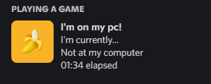
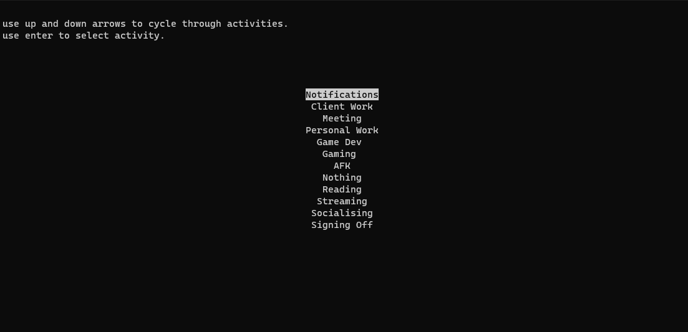

# Discord RPC
This is my implementation of discord rpc to show what i'm currently doing. Heavily inspired by [naomi's variant](https://github.com/nhcarrigan/discord-rpc).
## Installation

Install rpc by clonning this repo and installing dependencies.

```bash
git clone https://github.com/BANanaD3V/discord-rpc
cd discord-rpc
pip install -r requirements.txt
cd src
python main.py
```
PS: dont forget to rename `.env.example` to `.env` and change client id. You also need desktop client on PC to make this work.
    
## Screenshots





## Customization options

1. You can customize options in the `config.py` file. This file is using json. The keys is the name of option in selection menu. The value has 2 options: action and icon. Action is shown up in your discord RPC, icon is configured using discord's art asset manager. Feel free to ask questions in my discord - __BANana#0533__.

## License

This project licensed by [MIT](https://choosealicense.com/licenses/mit/) license.

## Countributing

Feel free to open PRs and help me with code, but please use [conventional commits](https://www.conventionalcommits.org/en/v1.0.0/) style.